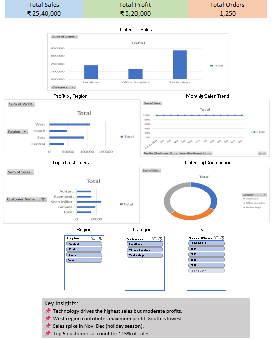

# Sales Analytics Dashboard Portfolio

## 📊 Project Overview
This repository showcases a set of interactive sales analytics dashboards designed to deliver actionable business insights for decision-makers.  
The dashboards focus on executive-level performance tracking, regional market analysis, and product/channel insights.

---

## 🖥️ Dashboards Included

### 1️⃣ Executive Sales Performance Dashboard

**Purpose:**  
Provides a high-level snapshot of overall business performance.

**Key Metrics:**
- Total Revenue
- Sales Growth Trends
- Key Performance Indicators (KPIs)

---

### 2️⃣ Regional Market Analysis Dashboard

**Purpose:**  
Analyzes sales distribution and performance across regions.

**Key Insights:**
- Region-wise revenue contribution
- High and low-performing markets
- Comparative geographic trends

---

### 3️⃣ Product and Channel Insights Dashboard

**Purpose:**  
Evaluates product mix and sales channel effectiveness.

**Key Insights:**
- Product category performance
- Channel-wise sales split
- Customer demand patterns

---

## 🛠️ Tools & Technologies
- Microsoft Excel / Power BI *(update as applicable)*
- Data Cleaning & Transformation
- KPI Design & Visualization
- Business Intelligence Principles

---

## 🎯 Use Case
- Management reporting
- Sales performance reviews
- Strategic planning and forecasting
- Portfolio demonstration for analytics and business roles

---

## 🎯 Learning Objective
To practice real-world sales data analysis using Excel by building
interactive dashboards and extracting actionable business insights.

## 📌 Author
**Tanushree Shende**  
B.E | E&TC | Aspiring Data Analyst 

